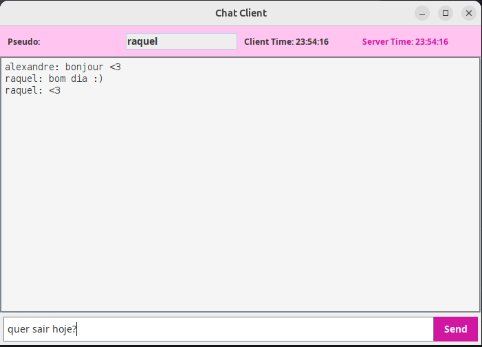

# Java technology projects

## 📂 Directory Listing Server (Sockets)
This server allows a client to request the contents of a directory using **Sockets**.

### 🔹 1️⃣ Start the Directory Server
To compile the java files:
```sh
cd Sockets_RMI/src/main/java/director_listing_server
javac -d out *.java
```
To start the server:
```sh
java -cp out director_listing_server.Server
```
It will wait for client requests.

### 🔹 2️⃣ Start the Directory Client
On another terminal, run:
```sh
java -cp out director_listing_server.Client
```
It will ask the **directory to list**.
```sh
Name the directory to be listed:
```
---


## 💬 Chat RMI Server



### 🔹 1️⃣ Compile the Code
To compile the java files:
```sh
cd Sockets_RMI/src/main/java/chat_server
javac -d out *.java
```

### 🔹 2️⃣ Start the RMI Chat Server
Now, run the chat server **using the `out/` directory as classpath**:
```sh
java -cp out chat_server.ChatServer
```
It should display the server IP, like:
```
Starting Chat and Time Server at 192.168.1.100...
```

### 🔹 3️⃣ Start the RMI Chat Client
On the **second computer** (or in another terminal), run:
```sh
java -cp out chat_server.ChatClient
```
It will ask for the **server IP** and **nickname**.

```sh
Insert your server IP: 192.168.1.100
Insert your pseudo: Alice
```

---

## 🎨 Graphical Interface (Chat)
- Field to enter your **nickname** 📛
- Area to display **chat messages** 💬
- Input field to **send messages** ✏️
- Displays **client and server time** ⏳

---

## 💖 Made with Love
🚀 Project developed for learning **Java RMI** and **Sockets-based communication**. If you have any questions, feel free to ask! 😊

