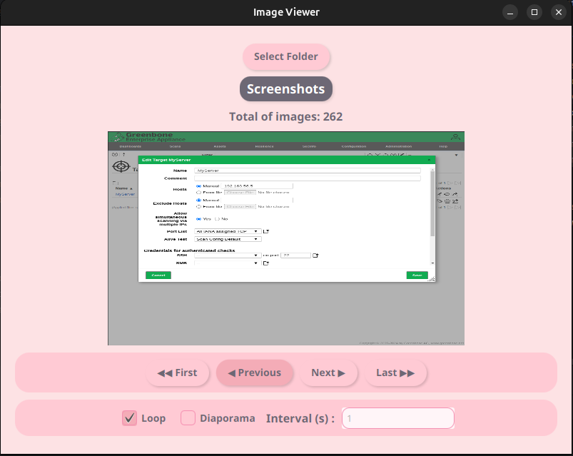

# 📷 Visionneuse d'Images en JavaFX

## 📝 Présentation
Ce projet est une application JavaFX permettant d'afficher les images contenues dans un répertoire. Il inclut un mode diaporama et un système de navigation entre les images. De plus, un composant observe les changements du répertoire et affiche le nombre d'images chargées.

## ✨ Fonctionnalités
- 📂 **Sélection d'un répertoire** contenant des images.
- 🔄 **Navigation** : Premère, Précédente, Suivante, Dernière.
- 🎞️ **Mode diaporama** avec défilement automatique des images.
- 🔁 **Mode boucle** pour recommencer après la dernière image.

## 🚀 Installation
1. **Cloner le projet**
2. **Ouvrir le projet dans IntelliJ** et s'assurer que JavaFX est configuré.
3. **Exécuter** la classe `MainApp.java`.

## 🖱️ Utilisation
1. **Cliquer sur "Sélectionner un répertoire"** et choisir un dossier contenant des images.
2. **Utiliser les boutons** pour naviguer entre les images.
3. **Cocher "Diaporama"** pour activer le mode automatique.
4. **Définir la durée** du diaporama en secondes.
5. **Observer la mise à jour** du nombre d'images chargées.

## 📸 Aperçu de l'interface

## 💻 Technologies
- **Java 17+**
- **JavaFX**
- **Scene Builder**
