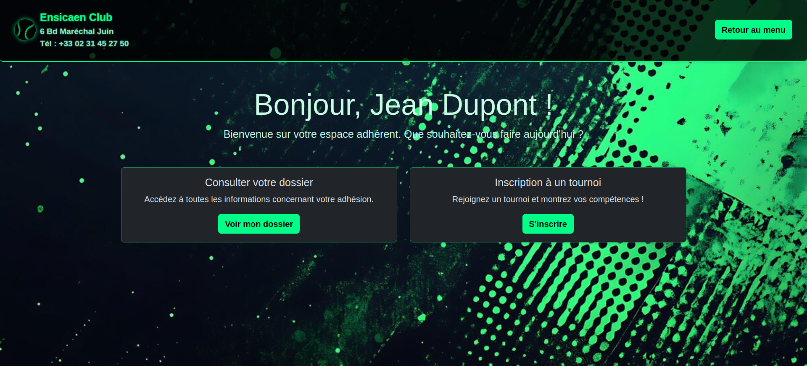
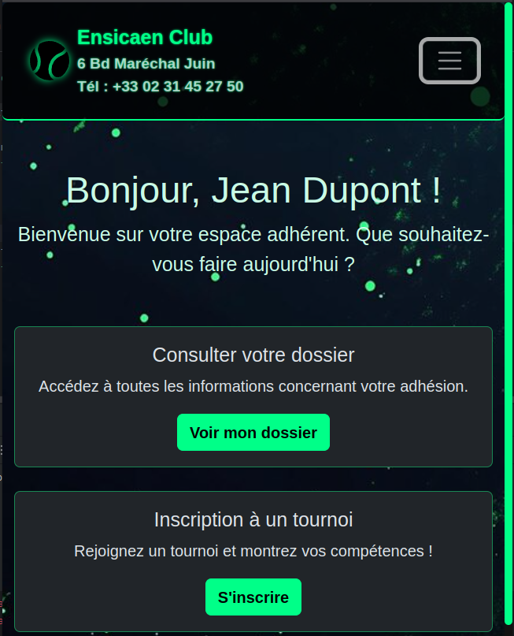
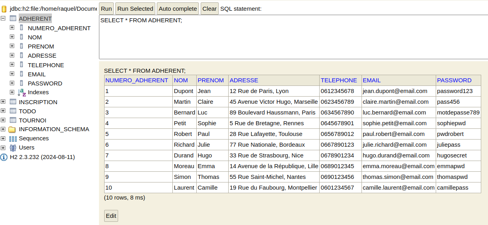
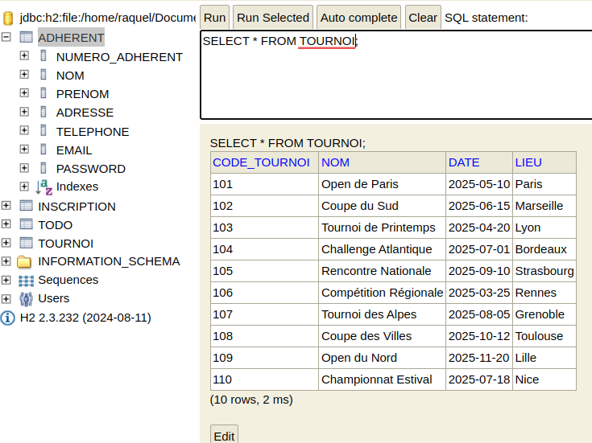

# 🎾 Club de Tennis ENSICAEN — Application Web

## 📸 Aperçu de l'interface

Ce projet est une application web de gestion d'un club de tennis. Elle permet aux adhérents de :

- Consulter les tournois disponibles
- S'inscrire à un tournoi
- Gérer leur profil
- Se connecter à l'espace membre

## 🔧 Technologies

- Java / Jakarta EE
- JSP / Servlets
- JPA / Hibernate
- Bootstrap 5
- Base de données relationnelle (H2)

## 🚀 Démarrage

1. Importer le projet dans IntelliJ ou Eclipse
3. Lancer le projet avec Tomcat ou un serveur compatible Jakarta EE

## 👤 Utilisateurs de test

|     Nom d'utilisateur       |   Mot de passe  |
|-----------------------------|-----------------|
| `jean.dupont@email.com`     | `password123`   |
| `claire.martin@email.com`   | `pass456`       |
| `luc.bernard@email.com`     | `motdepasse789` |
| `sophie.petit@email.com`    | `sophiepwd`     |
| `paul.robert@email.com`     | `pwdrobert`     |
| `julie.richard@email.com`   | `juliepass`     |
| `hugo.durand@email.com`     | `hugosecret`    |
| `emma.moreau@email.com`     | `emmapwd`       |
| `thomas.simon@email.com`    | `thomaspwd`     |
| `camille.laurent@email.com` | `camillepass`   |

Les mots de passe sont en clair uniquement pour les tests locaux.

